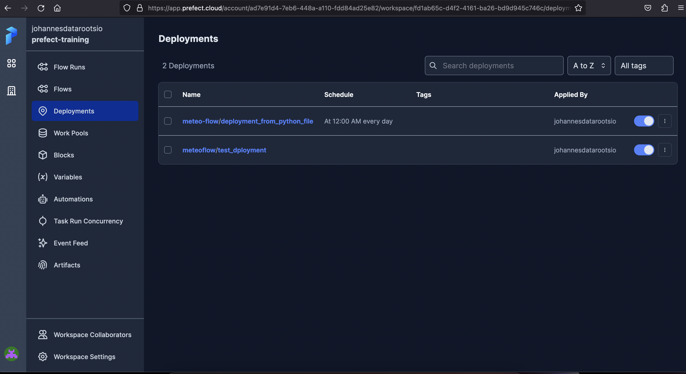
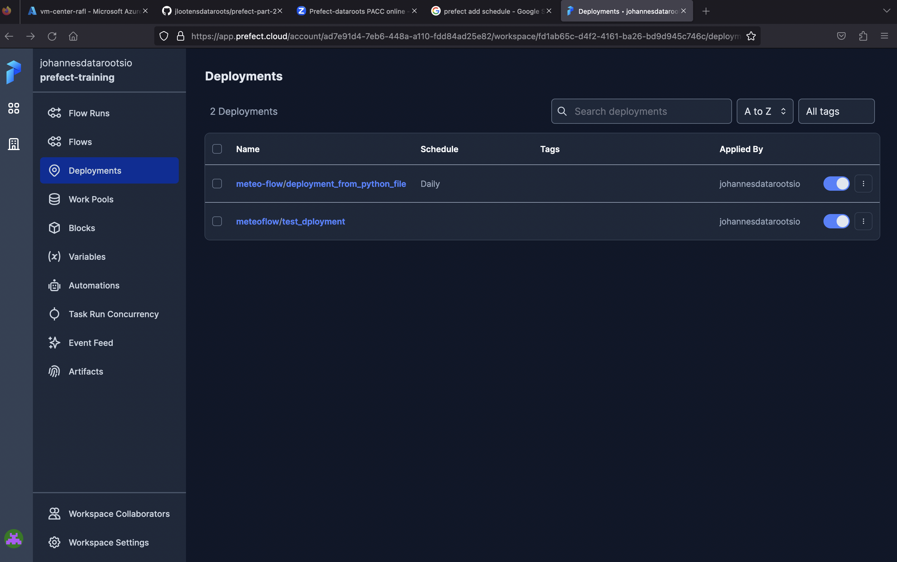
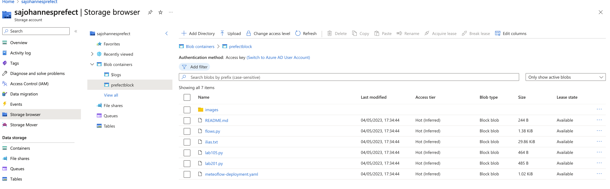
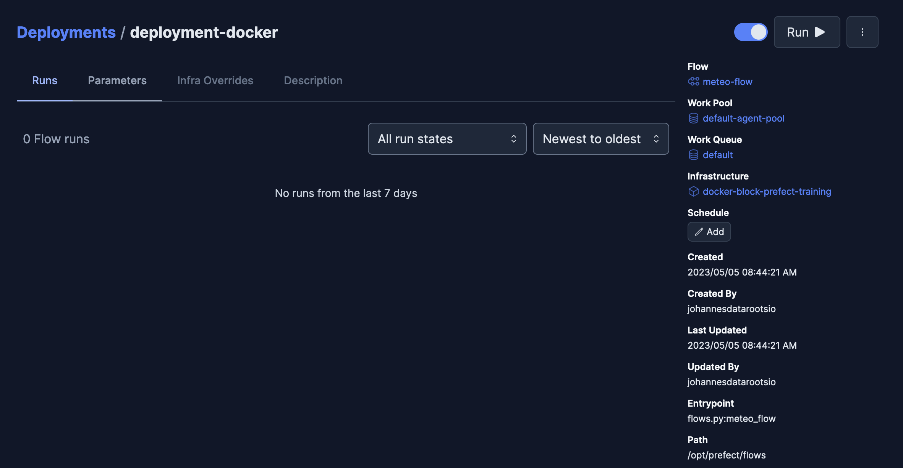

## LAB105

deployment created from python file with cron schedule

same deployment but with manual interval schedule of 1 day, added via UI
## LAB 201

result of azure deployment
## LAB 202
```
prefect deployment build flows.py:meteo_flow -n deployment-docker -ib docker-container/docker-block-prefect-training
prefect deployment apply meteo_flow-deployment.yaml 
```

deployment of meteo_flow on docker block  
## LAB 203
3h05
